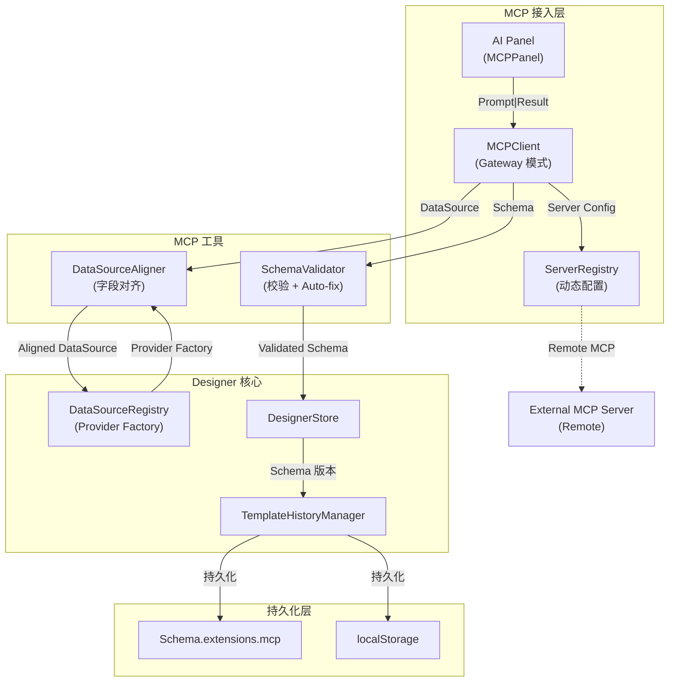
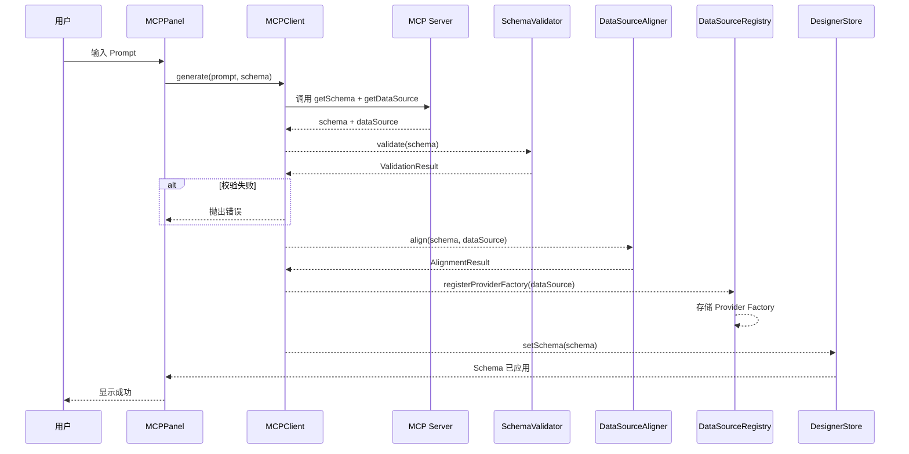
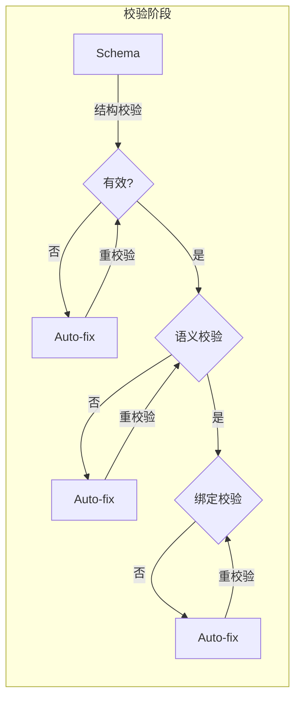

# 23. MCP 集成架构

本文档描述 EasyInk 设计器如何通过 MCP (Model Context Protocol) 接入 AI 能力，实现「用 AI 做文本输入后直出 schema 和 datasource」的功能。

## 23.1 目标与场景

### 核心目标

- 用户通过自然语言描述需求，AI 自动生成文档模板
- AI 生成 schema 和 datasource，设计器直接应用
- 支持多 MCP Server 动态配置
- 支持模板版本历史管理

### 使用场景

1. **快速生成**：用户输入"生成一个销售发票模板"，AI 返回完整 schema 和 datasource
2. **迭代优化**：用户可以在 AI 生成的基础上继续对话调整
3. **数据绑定**：生成 schema 时自动绑定到 AI 提供的数据源字段

## 23.2 架构概览



## 23.3 核心组件

### 23.3.1 MCPClient (`@easyink/mcp`)

MCP 客户端核心，负责与远程 MCP Server 通信。

```typescript
class MCPClient {
  // 服务器管理
  registerServer(config: MCPServerConfig): void
  updateServer(id: string, config: Partial<MCPServerConfig>): void
  removeServer(id: string): void
  getServers(): MCPServerConfig[]

  // 会话管理
  getSession(serverId: string): SessionMessage[]
  addSessionMessage(serverId: string, message: SessionMessage): void
  clearSession(serverId: string): void

  // 模板生成
  async generate(options: GenerateOptions): Promise<GenerateResult>
}
```

### 23.3.2 ServerRegistry (`@easyink/mcp`)

服务器配置管理，支持动态添加/编辑/删除 MCP Server。

```typescript
class ServerRegistry {
  // 内置服务器
  getBuiltinServers(): MCPServerConfig[]
  setEnabled(id: string, enabled: boolean): boolean

  // 用户服务器
  addServer(config: MCPServerConfig): void
  updateServer(id: string, updates: Partial<MCPServerConfig>): boolean
  removeServer(id: string): boolean

  // 持久化
  save(): void
  load(): void
}
```

### 23.3.3 SchemaValidator (`@easyink/mcp`)

Schema 校验器，支持自动修复。

```typescript
class SchemaValidator {
  constructor(options?: SchemaValidatorOptions)

  // 完整校验
  validate(schema: unknown): ValidationResult

  // 分层校验
  validateStructure(schema: unknown): ValidationResult
  validateSemantics(schema: DocumentSchema): ValidationResult
  validateBindings(schema: DocumentSchema): ValidationResult

  // 自动修复
  autoFix(schema: DocumentSchema): { fixed: DocumentSchema, issues: AutoFixedIssue[] }
}
```

### 23.3.4 DataSourceAligner (`@easyink/mcp`)

数据源字段对齐工具，确保 schema 中的 binding 字段与 datasource 中的字段匹配。

```typescript
class DataSourceAligner {
  align(schema: DocumentSchema, dataSource: DataSourceDescriptor): AlignmentResult

  // 字段提取
  extractFieldPaths(fields: DataFieldNode[]): Set<string>
  extractBindings(schema: DocumentSchema): BindingRef[]

  // 模糊匹配
  findFuzzyMatch(path: string, availablePaths: Set<string>): MatchResult | undefined
}
```

### 23.3.5 TemplateHistoryManager (`@easyink/designer`)

模板版本历史管理器。

```typescript
class TemplateHistoryManager {
  // 版本管理
  saveVersion(schema: DocumentSchema, metadata: VersionMetadata): string
  getVersion(id: string): TemplateVersion | undefined
  switchTo(id: string): DocumentSchema | undefined

  // 历史查询
  getHistory(options?: HistoryQuery): TemplateVersion[]
  getMcpVersions(): TemplateVersion[]
  getUserVersions(): TemplateVersion[]

  // 持久化
  save(): void
  load(): void
}
```

## 23.4 MCP 协议集成

### 23.4.1 连接模式

采用 **Gateway 模式**，设计器作为 MCP Client 连接远程 MCP Server：

```typescript
interface MCPServerConfig {
  id: string
  name: string
  type: 'stdio' | 'http'
  command?: string    // stdio 模式
  args?: string[]
  url?: string       // http 模式
  env?: Record<string, string>
  auth?: {
    type: 'bearer' | 'apikey'
    token?: string
  }
  enabled: boolean
}
```

### 23.4.2 工具定义

MCP Server 应暴露以下工具：

| 工具名 | 描述 | 参数 |
|--------|------|------|
| `getSchema` | 根据用户描述生成 schema | `{ prompt: string, currentSchema?: DocumentSchema }` |
| `getDataSource` | 根据 schema 需求生成 datasource | `{ schemaRequirements?: ExpectedDataSource }` |

### 23.4.3 AI 编排策略

采用 **AI 编排 + Schema-First** 策略：

1. AI 调用 `getSchema` 返回 schema，同时附带 `extensions.mcp.expectedDataSource`
2. AI 调用 `getDataSource` 时必须遵循 `expectedDataSource` 结构
3. Client 端进行字段对齐校验

## 23.5 数据流

### 23.5.1 生成流程



### 23.5.2 校验与修复



## 23.6 数据源命名空间

### 23.6.1 命名空间隔离

MCP 生成的数据源自动分配到 `__mcp__` 命名空间：

```typescript
// @easyink/datasource
export const MCP_NAMESPACE = '__mcp__'
export const DEFAULT_NAMESPACE = 'default'

// 工具函数
export function isMcpNamespace(ns?: string): boolean
export function getNamespacedId(id: string, namespace?: string): string
export function parseNamespacedId(fullId: string): { namespace, id } | null
```

### 23.6.2 稳定命名策略

BindingRef 中的 `sourceName` 和 `sourceTag` 作为稳定标识，用于 datasource 替换后的重匹配：

```typescript
interface BindingRef {
  sourceId: string        // 可变，datasource 替换后重新生成
  sourceName: string      // 稳定，数据源名称
  sourceTag?: string      // 稳定，数据源标签
  fieldPath: string
  // ...
}
```

## 23.7 Schema 持久化扩展

### 23.7.1 MCP 扩展字段

`DocumentSchema.extensions.mcp` 存储 MCP 相关数据：

```typescript
interface MCPExtensions {
  // MCP 数据源快照
  dataSources?: DataSourceDescriptor[]

  // Provider Factory 快照
  providerFactories?: ProviderFactorySnapshot[]

  // 模板版本历史
  templateHistory?: TemplateVersion[]

  // 当前版本 ID
  currentVersionId?: string

  // 期望的数据源结构（Schema-First）
  expectedDataSource?: ExpectedDataSource
}

interface TemplateVersion {
  id: string
  schema: DocumentSchema
  prompt?: string
  source: 'user' | 'mcp' | 'template'
  timestamp: number
  parentId?: string
}
```

## 23.8 用户界面

### 23.8.1 MCPPanel

独立面板形态，通过 emit 与 Designer 通信：

```
┌─────────────────────────────────┐
│ AI 模板生成                    × │
├─────────────────────────────────┤
│ 选择服务器                      │
│ ┌─────────────────────────────┐ │
│ │ Mock AI Server        ✓   │ │
│ └─────────────────────────────┘ │
├─────────────────────────────────┤
│ 描述你的模板                    │
│ ┌─────────────────────────────┐ │
│ │ 例如：生成一个销售发票模板...│ │
│ │                             │ │
│ └─────────────────────────────┘ │
│                    Ctrl+Enter   │
│                       [生成模板] │
├─────────────────────────────────┤
│ 会话历史                        │
│ ┌─────────────────────────────┐ │
│ │ 你: 生成发票模板             │ │
│ │ AI: ✓ 已生成                │ │
│ └─────────────────────────────┘ │
└─────────────────────────────────┘
```

### 23.8.2 TopBar 集成

工具栏右侧添加 MCP 按钮，点击打开面板：

```vue
<TopBarB @toggle-mcp-panel="toggleMCPPanel" />
```

### 23.8.3 Designer Props

```typescript
interface EasyInkDesignerProps {
  schema: DocumentSchema
  dataSources?: DataSourceDescriptor[]
  preferenceProvider?: PreferenceProvider
  locale?: LocaleMessages
  enableMCP?: boolean  // MCP 功能开关，默认 false
}
```

## 23.9 错误处理

### 23.9.1 校验错误

| 错误码 | 描述 | 处理方式 |
|--------|------|---------|
| `SCHEMA_NULL` | Schema 为空 | 拒绝 |
| `MISSING_VERSION` | 缺少版本字段 | Auto-fix |
| `UNKNOWN_MATERIAL_TYPE` | 未知物料类型 | 拒绝 |
| `BINDING_BLOCKED_PATH` | 绑定路径包含危险字符 | 拒绝 |

### 23.9.2 运行时错误

| 错误类型 | 处理策略 |
|---------|---------|
| 网络错误 | 手动重试按钮 |
| MCP Server 不可用 | 降级到内置模板选择器 |
| 解析错误 | 显示原始错误，允许用户修改 prompt |

## 23.10 安全考虑

1. **数据隔离**：MCP 数据源使用独立命名空间 `__mcp__`
2. **路径安全**：`BLOCKED_PATH_KEYS` 阻止原型链污染攻击
3. **认证支持**：支持 Bearer Token 和 API Key 认证
4. **Schema 校验**：拒绝未知物料类型，防止注入攻击

## 23.11 配置管理

### 23.11.1 服务器配置存储

服务器配置保存在 `localStorage` 中：

```typescript
// Key: 'easyink_mcp_servers'
const config = {
  servers: MCPServerConfig[],
  currentServerId?: string
}
```

### 23.11.2 预置服务器

框架内置模板生成服务（默认禁用）：

```typescript
const BUILTIN_SERVERS: MCPServerConfig[] = [
  {
    id: 'template-generator',
    name: '模板生成服务',
    type: 'http',
    url: 'http://localhost:3001/mcp',
    enabled: false
  }
]
```

## 23.12 包结构

```
packages/mcp/
├── src/
│   ├── index.ts                    # 导出入口
│   ├── client/
│   │   └── mcp-client.ts           # MCP Client 核心
│   ├── config/
│   │   └── server-registry.ts     # 服务器配置管理
│   ├── validation/
│   │   └── schema-validator.ts     # Schema 校验器
│   ├── types/
│   │   └── mcp-types.ts           # MCP 相关类型
│   └── utils/
│       └── datasource-aligner.ts   # 数据源对齐工具
└── package.json
```

## 23.13 依赖关系

```
@easyink/mcp
  ├── @easyink/datasource   (DataSourceDescriptor, DataFieldNode)
  ├── @easyink/schema       (DocumentSchema, BindingRef)
  ├── @easyink/shared       (generateId, deepClone)
  └── @modelcontextprotocol/sdk  (MCP 协议实现)

@easyink/designer
  ├── @easyink/mcp          (MCPPanel 组件)
  ├── @easyink/datasource   (MCP_NAMESPACE, ProviderFactory)
  └── ...
```
