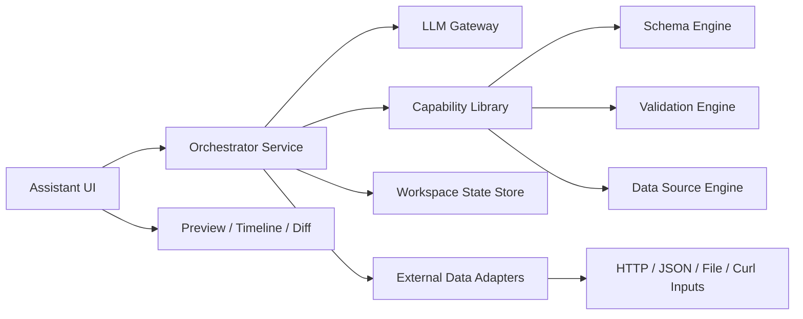

# 25. EasyInk Assistant Platform v3

本文是一次全新设计，直接替换旧的 AI / MCP 思路。

> **Hard Reset**
> - 不沿用现有 `packages/ai`、`packages/mcp-server` 的架构思想。
> - 不保留向下兼容承诺。
> - 不把 MCP 放进核心架构。
> - 旧实现只作为可退役资产，不作为新方案的边界。

## 25.1 设计结论

这次重构的目标不是“让聊天更聪明”，而是建立一个真正可持续的 Assistant Platform。

核心判断：

1. **MCP 不进核心**。它只是在外部生态里常见的一个接入协议，但对 EasyInk 的主产品链路不是必须件。
2. **Agent 只存在于编排层**。能力层必须是纯函数和纯接口，不夹带流程状态。
3. **先定义能力，再定义工作流**。不要反过来用工作流绑死能力。
4. **外部数据只做轻接入**。只支持 `curl`、HTTP、JSON、文件样例和可导入的结构化结果。

## 25.2 系统分层



### 25.2.1 层职责

- UI 层
  - 负责任务输入、结果预览、流程时间线、回滚和确认
- Orchestrator 层
  - 负责任务拆解、顺序调度、重试、澄清、版本管理
- Capability 层
  - 负责 schema、data source、validation、preview 相关的纯能力
- Adapter 层
  - 负责把 curl / HTTP / JSON / 文件转成结构化输入
- LLM Gateway
  - 只负责模型访问，不参与业务状态设计
- Workspace Store
  - 保存任务、草稿、版本、连接状态、用户选择

## 25.3 包结构

旧包退役，新包从零定义。

### 25.3.1 计划保留的包

- `packages/schema-tools`
  - 可以作为纯能力内核继续保留或重命名迁移

### 25.3.2 建议新包

```text
packages/assistant/ui
packages/assistant/orchestrator
packages/assistant/capabilities
packages/assistant/adapters
packages/assistant/llm
packages/assistant/store
packages/assistant/presets
packages/assistant/designer-bridge
```

包职责摘要：

- `assistant/ui`: Assistant 任务工作台 UI。
- `assistant/orchestrator`: LangGraph 编排服务。
- `assistant/capabilities`: schema / datasource / validation 纯能力。
- `assistant/adapters`: curl / HTTP / JSON / 文件输入适配。
- `assistant/llm`: LLM provider 统一适配。
- `assistant/store`: task、run、version、draft 存储。
- `assistant/presets`: 领域预设、模板策略、字段约束。
- `assistant/designer-bridge`: Designer Contribution 接入层，导出 `createAssistantContribution()`。

`assistant/designer-bridge` 负责把 Assistant 接入 Designer。接入方式继续采用 Designer Contribution 机制，可参考旧 `packages/ai/src/contribution.ts` 的模式：由 bridge 包导出 `createAssistantContribution()`，在宿主侧作为 contribution 注入 Designer，而不是让 Designer 直接依赖 Assistant。

### 25.3.3 旧包处置

- `packages/ai`
  - 退役
- `packages/mcp-server`
  - 退役

## 25.4 为什么不把 MCP 放进核心

MCP 的问题不是“没用”，而是“它不是 EasyInk 核心问题的最佳解”。

它适合做标准工具接入，但不适合作为 EasyInk 的主架构边界，因为：

- 它会把能力层和产品流程混淆
- 它会要求所有能力都以工具形式暴露，约束内部演进
- 它会让流程状态、会话状态、重试状态变成协议负担
- 它对本产品最重要的价值是“外部互联”，而不是“内部编排”

结论：

- **核心架构不使用 MCP**
- **如果未来真需要对外部编辑器开放，再单独做一个薄桥接层**

## 25.5 能力模型

能力层只定义原子能力，不定义业务流程。

### 25.5.1 Schema 能力

- schema 生成
- schema 修复
- schema 校验
- schema 差异分析

### 25.5.2 Data Source 能力

- curl 样例解析
- HTTP 样例抓取
- JSON 输入解析
- 文件输入解析
- 字段推断
- 字段映射

### 25.5.3 Preview 能力

- 结果预览
- 数据预览
- 错误诊断
- 对齐诊断

## 25.6 AI 编排模型

编排层由独立 Orchestrator 负责，典型流程是：

1. 识别任务类型
2. 判断是否需要数据源
3. 解析输入和约束
4. 调用能力层生成 schema / data source
5. 校验和修复
6. 输出可应用结果

### 25.6.1 工作流状态

建议状态如下：

- `idle`
- `intake`
- `plan`
- `source`
- `compose`
- `validate`
- `repair`
- `review`
- `done`
- `failed`

### 25.6.2 Agent 角色

- `Intake Agent`
  - 分类任务，抽取意图
- `Planner Agent`
  - 判断领域、纸张、模板方向
- `Source Agent`
  - 处理外部数据输入
- `Composer Agent`
  - 组合 schema 和 data source
- `Validator Agent`
  - 做校验和修复
- `Memory Agent`
  - 管版本和上下文

## 25.7 外部数据接入

只支持轻量、普遍、可解释的数据输入：

- `curl`
- HTTP API
- 直接 JSON
- JSON 文件

不支持首期复杂接入：

- 数据库
- SQL
- ETL
- 企业总线
- 复杂认证代理

原则是：

> 能用一段样例 JSON 说清楚的，就不引入重集成。

## 25.8 UI 设计

UI 采用 **对话优先** 的 Assistant 面板，而不是把用户直接暴露在复杂任务工作台里。

核心体验是：

> 用户像和助手协作一样提出需求，Assistant 通过消息、结构化卡片和明确按钮引导确认、修改、应用和回滚。

这不是旧聊天窗口的回归。对话只负责承载交互语境，所有可执行结果仍然必须是结构化的 task、event、result、patch、version。

### 25.8.1 首屏结构

Assistant 面板首屏由三块组成：

- `ConversationHeader`
  - 展示 Assistant 标题、运行状态、连接状态和设置入口
- `MessageList`
  - 展示用户消息、Assistant 文本回复、结构化结果卡、差异卡、数据源卡、澄清卡和进度消息
- `ComposerBar`
  - 输入自然语言，支持粘贴 JSON / curl / HTTP URL，支持文件入口和快捷指令

首屏不应该强行展示完整任务表单。数据源、差异、预览、版本都以消息卡片或可展开卡片的形式在对话流中出现。

### 25.8.2 对话消息模型

消息流不是纯文本，而是混合结构化消息：

```ts
type AssistantMessageBlock =
  | { kind: 'text', content: string }
  | { kind: 'progress', steps: AssistantWorkflowStep[], activeStep?: AssistantWorkflowStep }
  | { kind: 'source-card', sourceId: string, fieldCount: number, warnings: string[] }
  | { kind: 'result-card', resultId: string, summary: AssistantResultSummary }
  | { kind: 'diff-card', resultId: string, operations: AssistantPatchOperation[] }
  | { kind: 'clarification-card', questions: string[] }
  | { kind: 'error-card', message: string, recoverable: boolean }
```

消息卡片只展示摘要和可操作入口，不在消息流中塞完整 JSON。完整 schema、patch、source sample 通过详情面板或弹层查看。

### 25.8.3 确认应用体验

Assistant 生成候选结果后，不自动写入 Designer。

它应该在对话中返回一个 `ResultCard`：

- 页面尺寸
- 元素数量
- 数据字段数量
- 校验状态
- diff 摘要
- 风险提示和可修复问题

卡片动作：

- `应用到设计器`
- `查看差异`
- `预览`
- `继续修改`
- `重新生成`
- `取消`

用户点击 `应用到设计器` 后，UI 调用 Orchestrator 的 apply API，并通过 `assistant/designer-bridge` 把结果应用到 Designer。

### 25.8.4 数据源交互

数据源不是固定表单区，而是对话附件。

支持以下入口：

- 直接粘贴 JSON
- 直接粘贴 curl
- 输入 HTTP URL
- 上传 JSON 文件

Assistant 识别到数据源后，应该生成 `SourceCard`：

- 数据源类型
- 字段数量
- 字段树摘要
- 样例数据预览
- 解析警告

用户可以在卡片上确认、替换、删除或继续补充数据源。

### 25.8.5 进度展示

流程不再作为首屏大块 timeline 固定展示，而是压缩成对话中的进度消息。

典型进度：

```text
正在理解需求 -> 正在解析数据源 -> 正在生成模板 -> 正在校验 -> 等待确认
```

当流程失败时，Assistant 应在原位置给出错误卡和下一步动作，例如重新生成、补充字段、查看诊断。

### 25.8.6 组件建议

- `AssistantPanel`
- `ConversationHeader`
- `MessageList`
- `UserMessage`
- `AssistantMessage`
- `ComposerBar`
- `SourceAttachmentCard`
- `ProgressMessage`
- `ResultCard`
- `DiffCard`
- `ClarificationCard`
- `VersionCard`
- `ApplyConfirmation`

早期已经存在或实验过的工作台组件可以作为内部能力拆分复用，但不应成为主交互形态：

- `TaskComposer` -> 收敛为 `ComposerBar`
- `SourceInspector` -> 收敛为 `SourceAttachmentCard`
- `WorkflowTimeline` -> 收敛为 `ProgressMessage`
- `ResultPreview` -> 收敛为 `ResultCard`
- `DiffPanel` -> 收敛为 `DiffCard`

## 25.9 技术选型

优先使用热门开源项目，不自研底座。EasyInk 自己只沉淀领域能力：模板 DSL、数据源协议、字段映射、校验修复和设计器桥接。

### 25.9.1 后端 Orchestrator

| 能力 | 选型 | 落地包 | 说明 |
| --- | --- | --- | --- |
| Agent 编排 | LangGraph.js | `assistant/orchestrator` | 负责 multi-agent graph、条件分支、重试、人工确认节点 |
| HTTP 服务 | Hono | `assistant/orchestrator` | 提供 `POST /tasks`、`GET /tasks/:id`、`GET /tasks/:id/events` |
| 输入/输出校验 | Zod | 全部 assistant 包 | 所有跨包 DTO 都用 zod schema 定义 |
| LLM 接入 | 官方 provider SDK + `assistant/llm` 适配层 | `assistant/llm` | OpenAI / Anthropic / OpenAI-compatible 统一为 `LLMClient` |
| 服务端工作流状态 | LangGraph state + store snapshot | `assistant/orchestrator`、`assistant/store` | 编排态由 LangGraph 管，持久态进入 store |
| 日志 | pino | `assistant/orchestrator` | 结构化日志，方便调试 agent 运行链路 |
| 测试 | Vitest | 全部 assistant 包 | 工作流、capability、adapter 都做单元测试 |

后端边界：

- Orchestrator 不直接操作 Designer Store。
- Orchestrator 不直接写 EasyInk schema；它只产出候选结果和 patch。
- 所有确定性能力必须下沉到 `assistant/capabilities`。
- LLM 只负责判断、抽取和补全，不承担最终合法性。

### 25.9.2 前端 Agent UI

| 能力 | 选型 | 落地包 | 说明 |
| --- | --- | --- | --- |
| UI 框架 | Vue 3 SFC | `assistant/ui` | 与现有 designer 技术栈一致 |
| 对话状态机 | XState + `@xstate/vue` | `assistant/ui` | 管 idle、thinking、awaitingConfirmation、awaitingClarification、applying、failed 等 UI 状态 |
| 服务端状态 | TanStack Query for Vue | `assistant/ui` | 管 task、message projection、result、events、重试、缓存和失效 |
| 运行过程展示 | 对话进度消息优先，Timeline / Vue Flow 可选 | `assistant/ui` | 首期在消息流中展示 compact progress；复杂 graph 再切换为详情视图 |
| 组合工具 | VueUse | `assistant/ui` | 复用已有依赖生态 |
| 图标 | `@easyink/icons` | `assistant/ui` | 延续 EasyInk 图标体系 |
| 样式 | scoped SCSS + CSS variables | `assistant/ui` | 不引入大型 UI kit，避免破坏设计器风格 |

前端边界：

- UI 不直接调用 capability。
- UI 只和 orchestrator API 通信。
- UI 可以展示 agent 过程，但不能自己实现 agent 决策。
- UI 应把“应用结果”作为显式用户动作，不自动覆盖设计器 schema。
- UI 主交互必须是对话流；任务、数据源、预览、diff、版本等复杂对象通过结构化消息卡承载。
- UI 可以把 Orchestrator 的 task / event / result 投影成消息，但不能把消息本身当作持久真相。

### 25.9.3 Capability 层

| 能力 | 选型 | 落地包 | 说明 |
| --- | --- | --- | --- |
| Schema 构建 | 复用/迁移 `schema-tools` | `assistant/capabilities` | 把现有确定性构建能力迁进新包族 |
| Schema 校验 | 复用/迁移 `SchemaValidator` | `assistant/capabilities` | 作为结果提交前的硬门禁 |
| DataSource 对齐 | 复用/迁移 `DataSourceAligner` | `assistant/capabilities` | 负责字段路径和绑定对齐 |
| Diff | 自研最小领域 diff | `assistant/capabilities` | diff 只针对 EasyInk schema，不引入通用文本 diff 作为主逻辑 |
| Patch | JSON Patch 风格对象 | `assistant/capabilities` | Orchestrator 输出候选 patch，UI 确认后应用 |

Capability 规则：

- 纯函数优先。
- 不依赖 Vue。
- 不依赖 LangGraph。
- 不发网络请求。
- 不保存 session。

### 25.9.4 Adapter 与外部数据

| 能力 | 选型 | 落地包 | 说明 |
| --- | --- | --- | --- |
| curl 解析 | `curlconverter` | `assistant/adapters` | 把常见 curl 转为 fetch 请求配置 |
| HTTP 获取 | 原生 `fetch` | `assistant/adapters` | 只支持 JSON 返回 |
| JSON 解析 | 原生 JSON + Zod | `assistant/adapters` | 直接粘贴 JSON 是首选数据输入 |
| 文件解析 | File API / Node fs | `assistant/adapters` | 浏览器端和服务端分别适配 JSON 文件 |

不做：

- 数据库连接
- SQL 查询
- ETL
- 企业总线
- 自动处理复杂 OAuth 流程

### 25.9.5 Store 与版本管理

| 能力 | 选型 | 落地包 | 说明 |
| --- | --- | --- | --- |
| 浏览器草稿 | IndexedDB，优先 Dexie | `assistant/store` | 存 task draft、最近数据样例、运行结果 |
| 服务端任务状态 | SQLite 或文件型 store 起步 | `assistant/store` | 首期不引入重型数据库 |
| 版本记录 | append-only run/version log | `assistant/store` | 每次生成、修复、应用都形成版本事件 |
| 导出 | JSON snapshot | `assistant/store` | 便于调试和问题复现 |

### 25.9.6 运行协议

Orchestrator 对 UI 提供普通 HTTP API，不走 MCP。

```text
POST /assistant/tasks
GET  /assistant/tasks/:id
GET  /assistant/tasks/:id/events
POST /assistant/tasks/:id/cancel
POST /assistant/tasks/:id/apply
```

事件流优先使用 SSE：

```ts
type AssistantEvent =
  | { type: 'task.created', taskId: string }
  | { type: 'step.started', taskId: string, step: string }
  | { type: 'step.completed', taskId: string, step: string }
  | { type: 'clarification.required', taskId: string, questions: string[] }
  | { type: 'result.ready', taskId: string, resultId: string }
  | { type: 'task.failed', taskId: string, error: string }
```

### 25.9.7 首期依赖建议

```text
assistant/orchestrator:
  @langchain/langgraph
  @langchain/core
  hono
  zod
  pino

assistant/ui:
  xstate
  @xstate/vue
  @tanstack/vue-query
  @vue-flow/core   # 可选，仅用于复杂 graph 详情视图

assistant/adapters:
  curlconverter

assistant/store:
  dexie           # 浏览器侧
```

这些依赖都是边界依赖，不应泄漏到 `assistant/capabilities`。

### 25.9.8 选型参考

- [LangGraph.js](https://docs.langchain.com/oss/javascript/langgraph/overview)：用于长生命周期、状态化 agent 和 workflow 编排。
- [XState](https://stately.ai/docs)：用于前端复杂状态流、状态机和 actors。
- [Hono](https://hono.dev/docs)：用于轻量 HTTP API 和 SSE 服务。
- [TanStack Query for Vue](https://tanstack.com/query/latest/docs/framework/vue/overview)：用于前端 server state 获取、缓存、同步和更新。
- [Vue Flow](https://vueflow.dev/)：作为可选的流程图可视化方案。

## 25.10 推荐实现顺序

1. 先建 `assistant/capabilities`
   - 迁移 schema build / validate / repair / datasource align
2. 再建 `assistant/adapters`
   - 实现 JSON、curl、HTTP、JSON 文件输入
3. 再建 `assistant/orchestrator`
   - 使用 LangGraph.js 编排 intake -> plan -> source -> compose -> validate -> review
4. 再建 `assistant/store`
   - 保存 task、run、version、source sample
5. 再建 `assistant/ui`
   - 使用 XState + TanStack Query 接 orchestration API
   - 首期主界面采用对话式 `AssistantPanel`，通过结构化消息卡承载 result / diff / source / clarification
6. 最后接入 `assistant/designer-bridge`
   - 使用 Designer Contribution 机制接入，导出 `createAssistantContribution()`
   - 注册工具栏入口、Assistant 面板、命令和 apply/rollback 动作
   - 把候选 schema / patch 应用到 Designer
7. 旧 `ai` / `mcp-server` 只作为退役过渡，不再扩展

## 25.11 退役原则

以下内容不再进入新架构：

- 旧 MCP 工具协议
- 旧聊天会话存储
- 旧 server registry
- 旧单工具生成链路
- 旧包命名和职责边界

## 25.12 成功标准

新平台只有在下面几件事都成立时才算成功：

1. 不依赖 MCP 也能完成完整设计流程
2. 能轻量接入外部数据
3. 能稳定做版本、回滚和修复
4. 能把能力层和编排层彻底分开
5. 能让 UI、API、未来外部客户端各自独立演进
