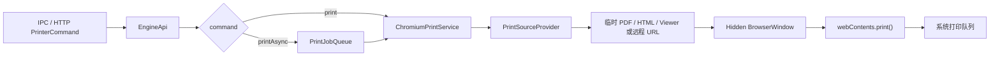

# EasyInk Electron

EasyInk Electron 是 `EasyInk.Printer (.NET)` 的 Electron/Chromium 版本。它复用 .NET 版本的职责边界和命令协议，但把打印执行层替换为 Chromium：隐藏 `BrowserWindow` 加载 PDF 或 HTML，然后调用 `webContents.print()`。

## 架构目标

- 保持 `Engine` 与 `Printer` 分层：Engine 负责打印链路，Printer 负责宿主能力。
- 不依赖 .NET Framework、PDFium/GDI、SumatraPDF。
- 支持 PDF 输入，也支持传入 HTML 与已渲染 Viewer 页面直接打印。
- Renderer 使用 Vue 3 + TypeScript + Pinia + vue-router；UI 按 shadcn-vue 的组件目录组织。
- HTTP/IPC 都走同一套 `PrinterCommand`，方便业务端从 .NET 版本平滑迁移。

## 与 .NET 版本的对应关系

| .NET                              | Electron                                      | 说明                              |
| --------------------------------- | --------------------------------------------- | --------------------------------- |
| `EasyInk.Engine/src/EngineApi.cs` | `src/main/engine/engine-api.ts`               | 统一命令入口。                    |
| `PrintJobQueue.cs`                | `print-job-queue.ts`                          | 单工作流异步队列。                |
| `PrinterService.cs`               | `chromium-printer-service.ts`                 | 使用 `getPrintersAsync()` 查询。  |
| `PdfiumPrintService.cs`           | `chromium-print-service.ts`                   | 使用 Chromium 加载并打印。        |
| `IPdfProvider`                    | `print-source-provider.ts`                    | 扩展为 PDF/HTML/Viewer 来源解析。 |
| `EasyInk.Printer/src/Api`         | `src/main/printer/api`                        | 宿主 API 层。                     |
| `HttpServer.cs`                   | `src/main/printer/server/http-server.ts`      | 本机 HTTP 服务。                  |
| `WebSocketHandler.cs`             | `src/main/printer/server/websocket-server.ts` | `/ws` 命令通道与 PDF 分片上传。   |
| WinForms UI                       | Vue Renderer                                  | 管理打印机、任务和日志。          |

## 打印链路



## HTML 与 Viewer 直打

Electron 版本新增以下字段：

| 字段         | 用途                               |
| ------------ | ---------------------------------- |
| `html`       | 传入 HTML 字符串。                 |
| `htmlBase64` | 传入 Base64 HTML。                 |
| `htmlUrl`    | 传入远程 HTML URL。                |
| `baseUrl`    | 为 HTML 中的相对资源提供基准 URL。 |
| `viewer`     | 传入已渲染 Viewer 页面 DOM。       |

HTML 会写入临时文件再由 Chromium 加载，以便脚本、样式、图片和字体按浏览器规则解析。打印结束后临时文件会被清理。

Viewer 打印用于业务端已经通过 `@easyink/viewer` 渲染出 `.ei-viewer-page` 的场景。传入 `viewer.pages`、可选 `viewer.styles/head/title` 后，Electron 会包装为独立 HTML 文档并按页分页打印。

## HTTP 示例

```bash
curl -X POST http://127.0.0.1:18081/api/print/async \
  -H 'Content-Type: application/json' \
  -d '{
    "printerName": "HP LaserJet",
    "html": "<h1>EasyInk</h1><p>Hello Chromium print.</p>",
    "copies": 1,
    "forcePaperSize": true,
    "paperSize": { "width": 210, "height": 297, "unit": "mm" }
  }'
```

## WebSocket 命令

Electron 版提供 `ws://127.0.0.1:18081/ws`，兼容官方 EasyInk Printer 客户端使用的命令：

| 命令                                         | 用途                   |
| -------------------------------------------- | ---------------------- |
| `print` / `printAsync`                       | 直接提交打印参数。     |
| `uploadPdfChunk`                             | 分片上传 PDF。         |
| `printUploadedPdf` / `printUploadedPdfAsync` | 打印已上传 PDF。       |
| `getPrinters` / `getPrinterStatus`           | 查询打印机。           |
| `getJobStatus` / `getAllJobs`                | 查询任务。             |
| `queryLogs`                                  | 查询 SQLite 审计日志。 |

## 边界说明

- Electron 版本的打印状态来自 Chromium/系统打印机枚举，语义比 Windows WMI 少。
- 当前 HTTP 层支持 JSON 请求体；二进制 multipart 可以在后续按 .NET `MultipartParser` 继续补。
- 审计服务使用 SQLite 持久化，默认写入 Electron `userData/data/audit.db`，日志查询参数与 .NET 版保持一致。
